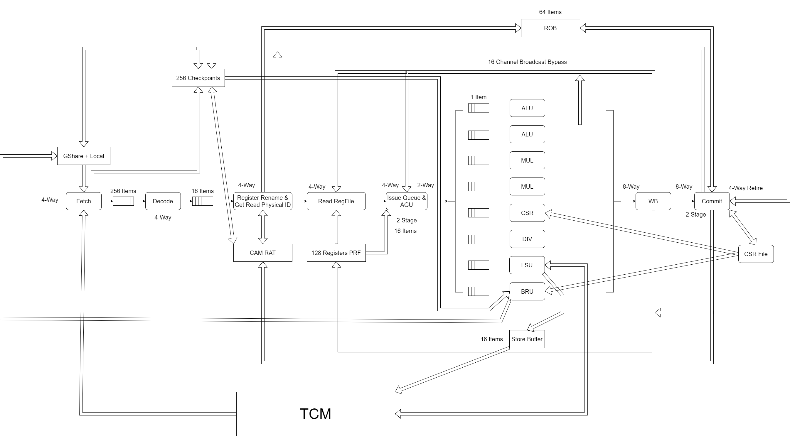

# 综述

## 简介
该处理器是一款RISC-V乱序超标量核，该处理核具有以下特性：

* 指令集为RV32IM
* 取指宽度为4
* 译码宽度为4
* 重命名宽度为4
* 寄存器读取宽度为4
* 发射宽度为2
* 写回宽度为8
* 退休宽度为4
* 支持64项ROB
* 支持256项Checkpoint
* 拥有GShare+Local混合预测器以及256项返回栈，同时具有面向call型和普通非条件分支指令的地址预测支持
* 支持16项Store Buffer
* 带有一个1MB的支持并行指令Fetch和数据Read/Write的TCM
* 带有CLINT及UART Controller

流水线结构如下：

## 性能参数

|BenchMark|迭代次数|分数|IPC|分支命中率|编译器版本|
|-|-|-|-|-|-|
|Coremark|1000|4.480702/MHz|1.262480|87.814716%|GCC 8.3|
|Coremark|10000|4.466658/MHz|1.258519|87.704843%|GCC 8.3|
|Coremark|10000|4.596025/MHz|1.229545|86.480199%|GCC 7.2|
|Dhrystone|500|3.039200DMIPS/MHz|1.826656|99.666835%|GCC 8.3|
|Dhrystone|500000|3.059931DMIPS/MHz|1.838698|99.998825%|GCC 8.3|
|Dhrystone|500|2.166761DMIPS/MHz|1.549750|95.689735%|GCC 7.2|
|Dhrystone|500000|2.247865DMIPS/MHz|1.607455|96.303688%|GCC 7.2|

## 综合结果

VCU1525（xcvu9p-fsgd2104-2L-e）：10MHz收敛

资源使用情况：

总量：LUT = 559892 DFF = 478328 BRAM = 512

各模块资源使用量：

|模块名|LUT|DFF|BRAM|
|-|-|-|-|
|branch_predictor_inst|199295|385163|0|
|checkpoint_buffer_inst|120939|38421|0|
|rob_inst|95022|16207|0|
|issue_inst|35236|5317|0|
|phy_regfile_inst|31958|4224|0|
|ras_inst|28198|16533|0|
|rat_inst|10432|896|0|
|store_buffer_inst|10369|1272|564|
|tcm_inst|9761|1384|512|
|multififo_decode_rename_inst|3722|10|0|
|readreg_inst|2737|0|0|
|multififo_fetch_decode_inst|2570|18|0|
|execute_div.generate[0].execute_div_inst|2248|0|0|
|csrfile_inst|1363|1169|0|
|rename_inst|1061|0|0|
|commit_inst|890|115|0|
|decode_inst|735|0|0|
|execute_alu_generate[0].execute_alu_inst|535|0|0|
|execute_alu_generate[1].execute_alu_inst|535|0|0|
|fetch_inst|469|33|0|
|clint_inst|241|161|0|
|execute_mul_generate[0].execute_mul_inst|206|0|0|
|execute_mul_generate[1].execute_mul_inst|206|0|0|
|execute_bru_generate[0].execute_mul_inst|206|0|0|
|bus_inst|116|5|0|
|execute_lsu_generate[0].execute_lsu_inst|68|0|0|
|execute_csr_generate[0].execute_lsu_inst|65|0|0|
|uart_controller_inst|43|53|0|
|wb_inst|9|0|0|
|interrupt_interface_inst|4|0|0|
|fifo_issue_mul_interface[0].issue_mul_fifo|3|196|0|
|fifo_issue_mul_interface[1].issue_mul_fifo|3|196|0|
|fifo_issue_lsu_interface[0].issue_lsu_fifo|3|196|0|
|fifo_issue_div_interface[0].issue_div_fifo|3|196|0|
|fifo_issue_csr_interface[0].issue_csr_fifo|3|146|0|
|fifo_issue_bru_interface[0].issue_bru_fifo|3|268|0|
|fifo_issue_alu_interface[0].issue_alu_fifo|3|260|0|
|fifo_issue_alu_interface[1].issue_alu_fifo|3|260|0|
|port_wb_commit_inst|1|971|0|
|port_rename_readreg_inst|1|942|0|
|port_readreg_issue_inst|1|1194|0|
|port_mul_wb_interface[0].mul_wb_port|1|159|0|
|port_mul_wb_interface[1].mul_wb_port|1|159|0|
|port_lsu_wb_interface[0].lsu_wb_port|1|159|0|
|port_div_wb_interface[0].div_wb_port|1|159|0|
|port_csr_wb_interface[0].csr_wb_port|1|161|0|
|port_bru_wb_interface[0].bru_wb_port|1|192|0|
|port_alu_wb_interface[0].alu_wb_port|1|159|0|
|port_alu_wb_interface[1].alu_wb_port|1|159|0|